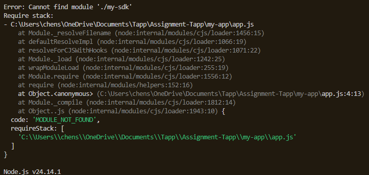
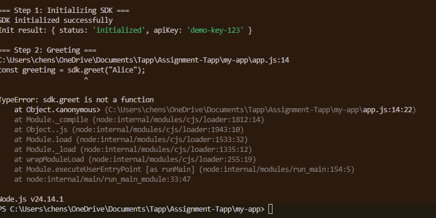
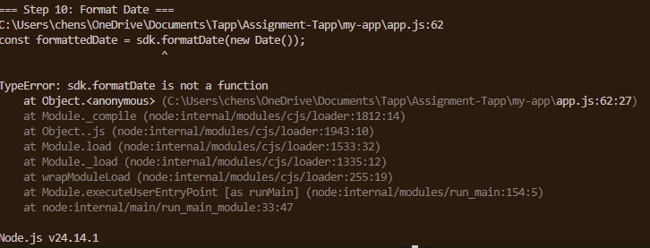

**First Error:**

The first error is caused because the module was not found.
We can see in my-app/package.json that the dependency is called 'my-sdk' and not './my-sdk'.
In the app, we should import using the package name and not a relative path.

**After fixing the SDK error:**

'greet' is not a function in the SDK. The error is caused because line 14 in my-app/app.js calls sdk.greet("Alice"), which is a function that does not exist (or has a typo).

**After fixing the greet function error:**

'formatDate' is not a function in the SDK. The error is caused because line 62 in my-app/app.js calls sdk.formatDate(new Date()), which is a function that does not exist (or has a typo).