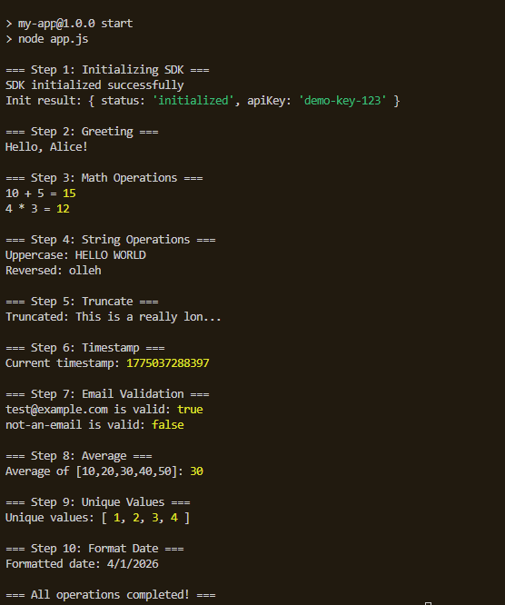

1. **SDK error:**

    a. The error message: 
    
    "Error: Cannot find module './my-sdk'"

    b. File: "app.js" Line: 4.

    c. 
    
        Before: const sdk = require("./my-sdk");

        After: const sdk = require("my-sdk");

    d. As said, this is the name of the package in the dependencies (we don't need to use the path).

2. **Greet error:**

    a. The error message: 
    
    "TypeError: sdk.greet is not a function"

    b. File: "app.js" Line: 14.

    c. 

        Before: const greeting = sdk.greet("Alice");

        After: const greeting = sdk.sayHello("Alice");

    d. Calls the right function instead which exists in the SDK.

3. **FormatDate error:**

    a.The error message: 
    
    "TypeError: sdk.formatDate is not a function"

    b. File: "app.js" Line: 62.

    c. 

        Before: const formattedDate = sdk.formatDate(new Date());

        After: const formattedDate = (new Date()).toLocaleDateString();

    d. Change to the object method. Date is a built-in class in Javascript that has built-in format method.

The complete run:

