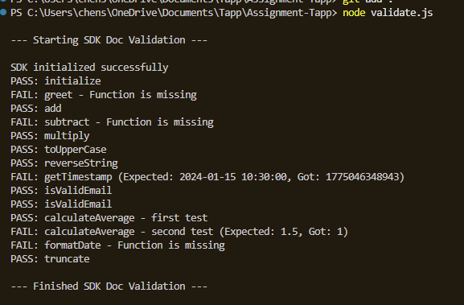

The full terminal output of running your script:

**Explanation:**
1. Test Data: I created an array called "testCases" that stores everything from the documentation: the function name, the args and the expected result (and for some comment with the test number if there is few tests for the same function).

2. The Loop: I used forEach to test each item in the test array.

3. 
    a. First Check: Before calling the function we check if it is exist in the SDK using typeof. If it's missing it prints FAIL and moves to the next one without crashing. 

    b. (else) if the function exist:
    Run The Function: I used the Spread Operator (...test.args) to pass the parameters.
    * for "initialize" function that returns an object the test checks the object to verify that both status and apiKey are correct.
    * for other functions is the result equals to the expected value it return PASS or FAIL with the reall output and the expected one.
    * if there is few tests for the same function it aadd the test number

Note: I wanted to use [jestjs](https://jestjs.io/) but since the assignment required the script to run with the commend
`node validate.js` without external dependencies, I decided to build a custom, lightweight validation logic.
   
What was the hardest part? most challenging part was was to choose for the best way to do the test so it will be generic and will not use outside libaries. 

What did I learn? I learned how to use the Spread operator to pass arguments cleanly in JS like *args in Python.